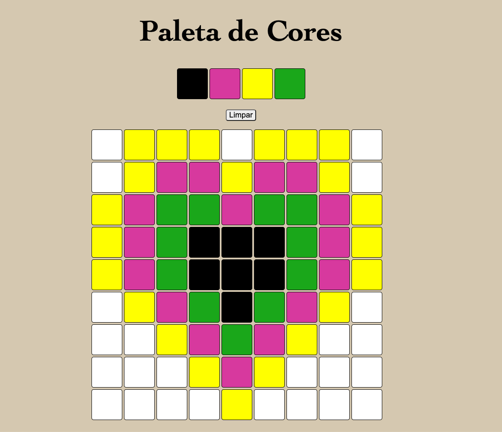

# Project Image

# About the Project
In this project, a simple pixel art editor was implemented.

Given a color palette and a frame composed of pixels, you are allowed to paint whatever you want on the frame!

# Languages and Tools:
- html
- JS
- CSS

